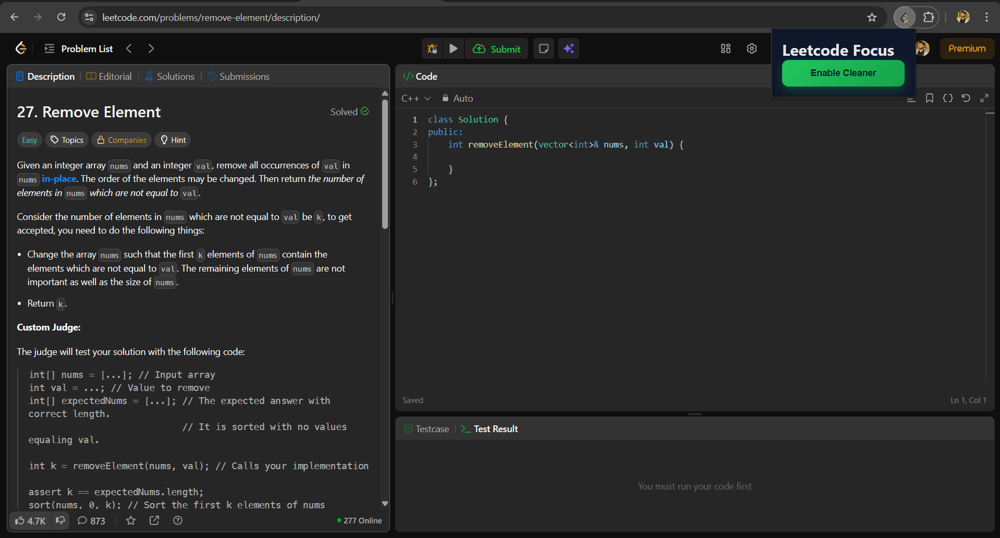

# LeetCode Focus🚀

A lightweight Chrome extension that instantly hides unwanted LeetCode UI elements **before they render**, creating a cleaner and distraction-free problem-solving experience.

Built using **CSS injection at document start** to ensure **zero flicker** and maximum performance.

---

## ✨ Features

- ⚡ **Instant UI blocking** (no page flash)
- 🎯 Targets specific LeetCode layout elements
- 🧠 Uses CSS injection instead of DOM removal
- 🔁 Enable / Disable toggle from popup
- ♻️ Auto refresh on toggle
- 🔒 No external APIs, no tracking, no data collection

---

## 🧩 Why This Extension?

LeetCode is a React-based SPA, which means:
- UI components load dynamically
- Removing elements *after* render causes visible flicker

This extension solves that by:
- Injecting CSS at `document_start`
- Preventing unwanted elements from ever being painted

This is the same technique used by professional ad blockers.

---

## 🛠️ Tech Stack

- **Chrome Extension (Manifest v3)**
- **Vanilla JavaScript**
- **CSS Injection**
- **Chrome Storage API**

No frameworks. No dependencies.

---

## ⚙️ How It Works (High Level)

1. The extension loads at `document_start`
2. A `<style>` tag is injected into the page
3. Targeted LeetCode layout elements are hidden using `display: none`
4. A popup toggle allows enabling or disabling the behavior
5. Page reload applies changes instantly

---

## 📦 Installation (Development)

Follow these steps to run the extension locally:

1️⃣ **Clone the repository**

```bash
git clone https://github.com/your-username/leetcode-css-cleaner.git
```

2️⃣ **Open Chrome Extensions page**

```
chrome://extensions
```

3️⃣ **Enable Developer Mode** (top-right corner)

4️⃣ **Load the extension**

* Click **Load unpacked**
* Select the project folder

5️⃣ **Visit any LeetCode problem page**
✅ The extension is now active!

---

## 🖱️ Usage

* Click the **extension icon** in the Chrome toolbar
* Toggle **Enable Cleaner**
* The page **reloads automatically**
* 🚫 Unwanted UI elements never appear

You can disable the cleaner anytime from the popup.

---

## 🔐 Permissions Explained

| Permission       | Purpose                        |
| ---------------- | ------------------------------ |
| `storage`        | Save enable / disable state    |
| `leetcode.com/*` | Apply changes only on LeetCode |

🔒 No other permissions are requested or used.

---

## 📸 Screenshots🖼️
Before

After


---

## 🚧 Limitations

* Selectors depend on LeetCode’s current DOM structure
* UI changes on LeetCode may require selector updates

---

## 🚀 Future Improvements

* 🎯 Safer attribute-based selectors
* 🎛️ Multiple UI toggles
* 📄 Per-page customization
* 🏪 Chrome Web Store release (Unlisted / Public)

---

## 🤝 Contributing

Contributions are welcome!
Feel free to open issues or submit pull requests to improve stability or add features.

---

## 📄 License

MIT License

---

## 👤 Author

**Ritesh**
Frontend / Full-Stack Developer
Focused on performance-driven browser extensions and web tooling.

---

⭐ If this project improves your LeetCode workflow, consider giving it a star!

